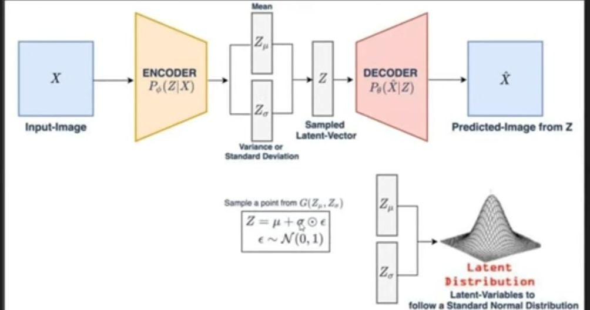

## Speech Variational Autoencoder
- A Variational Autoencoder (VAE) is a type of generative model that is widely used in unsupervised
  machine learning. Unlike traditional autoencoders, which are designed for tasks like dimensionality reduction and feature learning, VAEs are capable of generating new data samples that are similar to those in the training set. This is achieved by learning a probabilistic latent space, which encodes the distribution of the training data in a lower-dimensional space.

# Variational Autoencoder (VAE) Model Overview Model Structure

## This VAE model consists of three main components:
    - Encoder: Compresses the input data into a lower-dimensional latent space.
    - LatentZ: Represents the probabilistic latent space, where the model learns to approximate the 
      distribution of the input data.
    - Decoder: Reconstructs the input data from the latent representation.

## Components
1. Encoder </b>
   The Encoder is a neural network that processes the input data and encodes it into a latent representation. It consists of the following layers:
   - Convolutional Layers (conv1, conv2, conv3): Three 1D convolutional layers that extract features from 
     the input data. Each convolutional layer is followed by a ReLU activation function and a max-pooling layer that reduces the dimensionality of the feature maps.
   
   - Max-Pooling Layers (pool): These layers reduce the size of the feature maps by half, effectively 
     downsampling the data.
   
   - Flatten Layer (flatten): Flattens the 1D feature maps into a single vector.

   - Fully Connected Layer (fc): A fully connected layer that reduces the flattened feature map into a 
     hidden representation (latent space).

2. LatentZ</b>
  The LatentZ module is responsible for generating the latent variables (mu and logvar) that define the distribution from which the latent vector z is sampled. It consists of:
   -  mu Layer: A linear layer that outputs the mean (mu) of the latent distribution.
   - logvar Layer: A linear layer that outputs the logarithm of the variance (logvar) of the latent 
     distribution.
   - Sampling: The latent vector z is sampled from a normal distribution parameterized by mu and logvar 
     using the reparameterization trick: z = mu + std * eps, where std is the standard deviation and eps is random noise drawn from a standard normal distribution.

3. Decoder</b>
  The Decoder reconstructs the input data from the latent vector z. It consists of the following layers:
    - Fully Connected Layers (fc1, fc2): The first layer maps the latent vector z back to the hidden size. 
      The second layer maps this hidden representation back to a flattened feature map.
    - Unflatten Layer (unflatten): Reshapes the flattened feature map back into the original shape suitable 
      for the deconvolutional layers.
    - Deconvolutional Layers (deconv1, deconv2, deconv3): These layers upsample the feature maps, 
      effectively reversing the convolutional layers in the encoder. The final deconvolutional layer outputs the reconstructed data, which is scaled between 0 and 1 using a sigmoid activation function.

